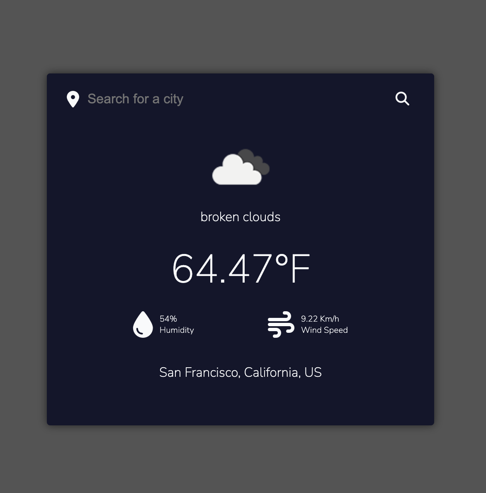

# WeatherApp

## Description
Simple weather app that uses OpenWeatherMap API. Shows temperature, humidity and wind speed for any city you search.

## Warning
You need to create a `.env` with the API key retrieved from [OpenWeatherMap](https://openweathermap.org/appid).
Follow the following format:
```javascript
API_KEY='Your Api Key'
```
## Screenshot

